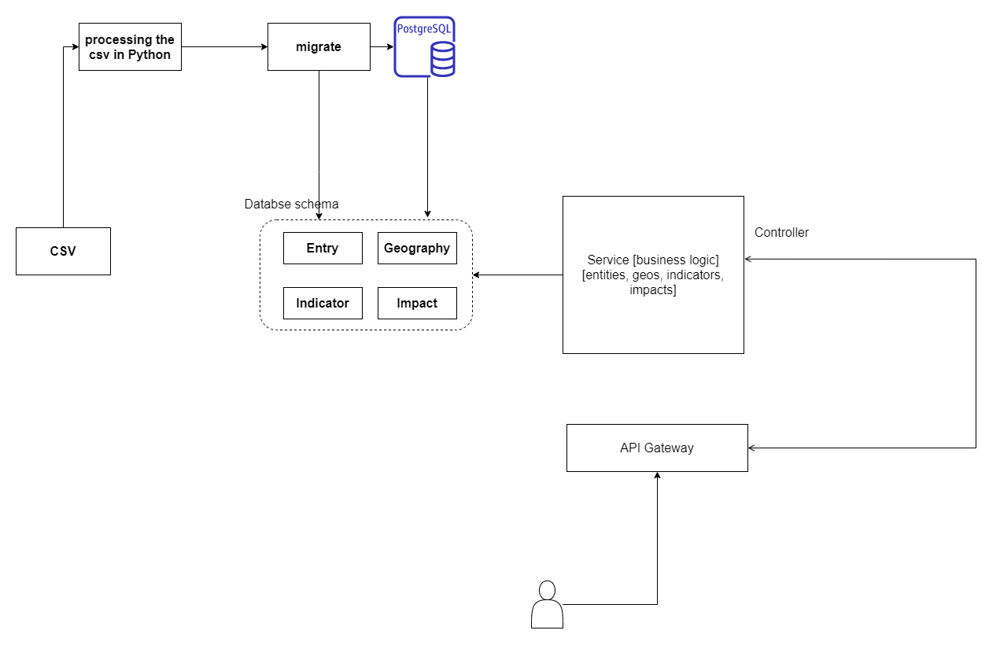

# Metabolic Assignment

* An application built as a **microservice** which hosts data in the form of a **REST API**.
* It uses **docker-compose** to run services.
* There are three services primary in docker-compose.yml: (**db**, **pgadmin**, **app**)
* **db service**: Database is run over db service.
* **pgadmin**: Pgadmin is used to access the database and for query purposes.
* **app**: This is the main service which contains the logic for accessing the data from the db. **Dockerfile** is dedicated to the setup of this service.
* **app** is written in **FastAPI**, **endpoints** are validated using **Pydantic**
* It has **volumes** support(Persistant storage in DBs).
* **Alembic** is used as a migration manager.

## Requirement or Assumption
* Docker and **docker-compose**
 
## Architecture
 


## Installation

```bash
# Step 1: cd into the repository root after cloning
# rename .env.template to .env
# also don't forget to fill the valid placeholders in .env. These serve as environment variables
$ mv .env.template .env
```
```bash
# Step 2 Build the microservice
$ docker-compose build
```
```bash
# Step 3 Run the microservice container
$ docker-compose up
```
```bash
# Open another terminal
# Step 4 Setup versions directory for alembic
$ docker-compose run app mkdir migration/versions/
```
```bash
# Step 5
# Issue command to the app for setting up migrations
$ docker-compose run app alembic revision --autogenerate -m "1st Schema Migration"
```
```bash
# Step 6 Apply those migrations
$ docker-compose run app alembic upgrade head
```
```bash
# Step 7 Add valid data to the tables 
$ docker-compose run app python src/scripts/data_preparation.py
```
```bash
# Step 8 Run the unit tests
$ docker-compose run app python -m unittest src/tests/unit_test.py
```


## Sample Usage

```bash
# After installation, api will run on localhost:8000
$ docker-compose up
```
* To access automatically generated swagger schema go to http://localhost:8000/docs

```bash
# To remove the project and volumes
$ docker-compose down -v
```

## Checklist
- [x] Added Unit Tests
- [x] docker-compose.yml file is fully fledged
- [x] PG-Admin for accessing and querying db
- [x] Well documented Swagger Page(OpenAPI)  
- [ ] To add async support as psycopg2 is sync
- [ ] API Gateway
- [ ] Logging

## Improvements
* Using an async database driver to make async calls to the database in order to make the application fully asynchronous
* Putting logging mechanism
* Implementing API Gateway.

## Contributing
Pull requests are welcome. For major changes, please open an issue first to discuss what you would like to change.
You can also drop a mail to [Prashant Tyagi](mailto:tyagi.prashant0099@gmail.com)
Please make sure to update tests as appropriate.

## License
[MIT](https://choosealicense.com/licenses/mit/)
